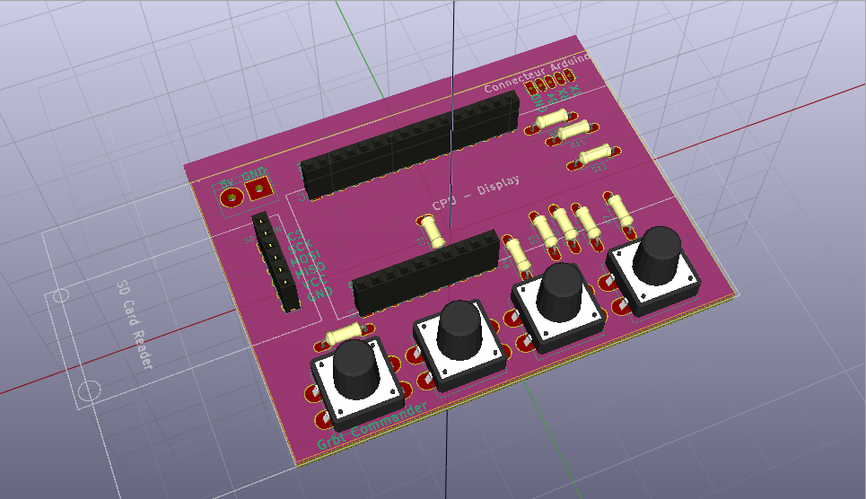
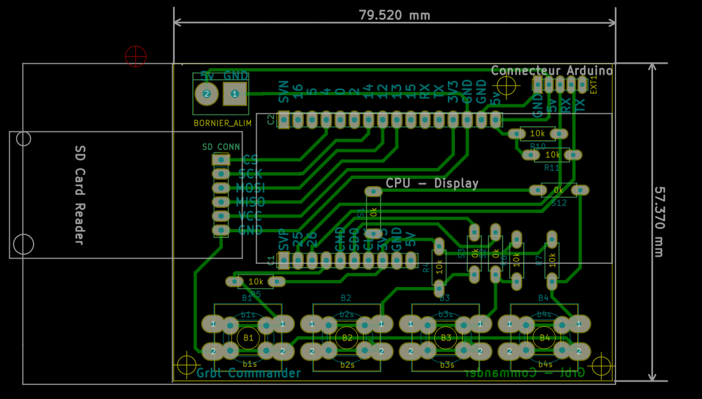

## GRBLCommander

*Patrice Freydiere - 2018*

This project currently in progress aim to provide a GUI and autonomous controller for GRBL CNC . 

### Project targeted functionalities

- Do initialisation stuff (HOMING)
- Read GRBL files from SDCard
- Follow Status while processing

### Hardware

- Weemos ESP32 with OLED 
- SDcard Reader
- Buttons

### 