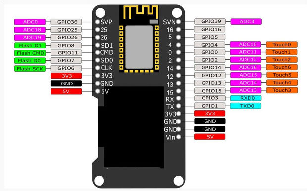

# PINS Mapping for the GrblCommander (WemosLolin32)

## PINS

| LOLIN32 PIN | Arduino IDE PIN | ROLE | Note                   |
| ----------- | --------------- | ---- | ---------------------- |
| CLK         | GPIO06          | B4   | CANNOT BE USED / FLASH |
| SDO         | GPIO07          | B3   | CANNOT BE USED / FLASH |
| SD1         | GPIO08          | B1   | CANNOT BE USED / FLASH |
| CMD         | GPIO11          | B2   | CANNOT BE USED / FLASH |
|             | GPIO5           |      | Screen                 |
|             | GPIO4           |      | Screen                 |
|             | GPIO16          |      | SDCARD CS              |
|             | GPIO12          |      | SDCARD                 |
|             | GPIO13          |      | SDCARD                 |
|             | GPIO14          |      | SDCARD                 |

